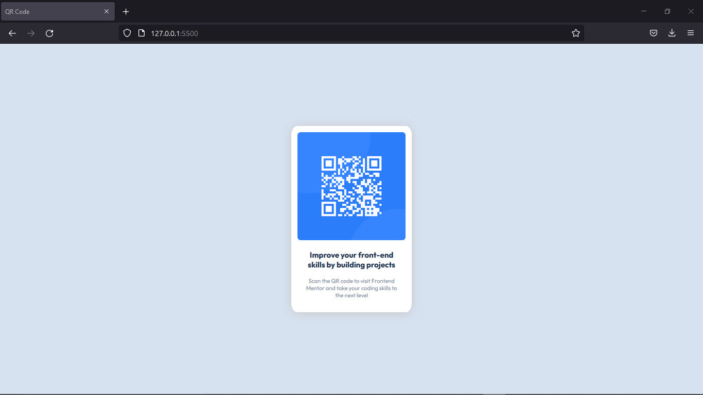
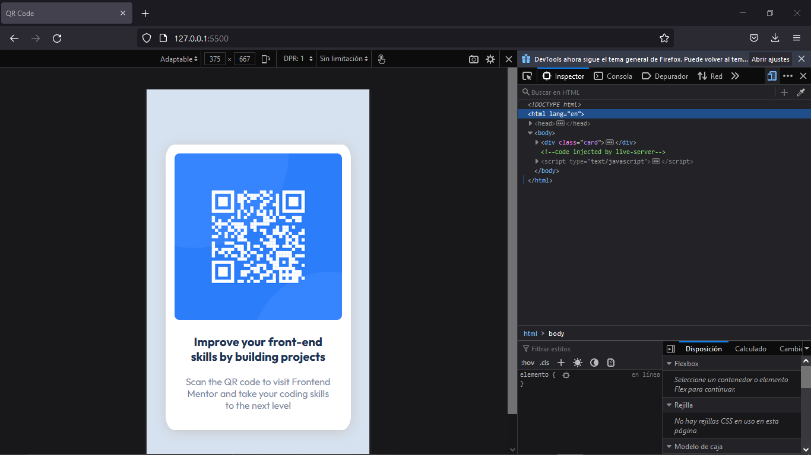

# Componente QR code 

Esta es la solucion a [QR code component challenge on Frontend Mentor](https://www.frontendmentor.io/challenges/qr-code-component-iux_sIO_H). 

## Contenido

- [Componente QR code](#componente-qr-code)
  - [Contenido](#contenido)
  - [Informacion general](#informacion-general)
    - [Screenshots](#screenshots)
    - [Links](#links)
    - [Construido con](#construido-con)
    - [Que aprendi](#que-aprendi)
    - [Recursos utiles](#recursos-utiles)
  - [Autor](#autor)


## Informacion general

### Screenshots




### Links

- Solucion URL: [Add solution URL here](https://your-solution-url.com)
- Sitio URL: [Add live site URL here](https://your-live-site-url.com)

### Construido con

- HTML5
- CSS
- Responsive Web Design

### Que aprendi

Posicionar un elemento dentro del body y adaptarlo para dispositivos moviles.

Posicionando el elemento card en el centro del body

```css
.card{
    width: 210px;
    height: 350px;
    padding: 12px;
    padding-bottom: 0;
    border-radius: 5%;
    /* white */
    background-color: hsl(0, 0%, 100%);
    margin: 0;
    position: absolute;
    top:50%;
    left: 50%;
    transform: translate(-50%, -50%);
    box-shadow: 0px 2px 20px 0px rgb(200, 199, 199);
}
```
Si la ventana del navegador tiene 375px o menos, se aplican los siguientes cambios.
```css
@media only screen and (max-width: 375px) {
    .card{
        width: 75%;
        height: 70%;
        padding: 15px;
        padding-bottom: 0;
        border-radius: 5%;
        /* white */
        background-color: hsl(0, 0%, 100%);
        margin: 0;
        position: absolute;
        top:50%;
        left: 50%;
        transform: translate(-50%, -50%);
    }
    .title {
        font-size: 20px;
        font-weight:700;
        /* dark blue */
        color: hsl(218, 44%, 22%);
        width:90%;
        margin:20px auto ;
   }
    
    .sub-title{
        font-size: 16px;
        font-weight: 400;
        color: hsl(220, 15%, 55%);
        width:90%;
        margin: 10px auto;
    }
    
  }
```

### Recursos utiles

- [Propiedad position](https://www.w3schools.com/css/css_positioning.asp#:~:text=An%20element%20with%20position%3A%20absolute,moves%20along%20with%20page%20scrolling.) - Ayuda a entender la propiedad position en CSS
- [Responsive Web design](https://www.w3schools.com/css/css_rwd_mediaqueries.asp) - Para compender el diseno web responsive.

## Autor

- Website - [Nicolas Gula](https://www.your-site.com)
